deadpool代理池工具，可从**hunter**、**quake**、**fofa**等**网络空间测绘平台取socks5**代理，或**本地导入socks5**代理，轮询使用代理进行流量转发。
> **开发不易,如果觉得该项目对您有帮助, 麻烦点个Star吧**

**2024-09-15改动：增加周期性任务：根据配置信息，定时检测存活、定时从网络空间取代理**

**2024-09-12改动：go环境改为了1.23 ,工具新增了socks5账号密码认证功能，配置文件[listener]下新增了userName和password字段**

### 0x01 说明

**提前总结：快速使用本工具，只需要修改配置文件中对应的网络空间测绘平台的key信息，直接命令行运行程序即可。**

在【明确获得合法授权】的前提下，大家一定遇到过攻防过程中IP被ban的情况，这时候，既想要数量可观的高质量代理，又不想花钱，怎么办？那么用本工具可以一定程度上解决这个问题。

1、通过配置hunter、quake、fofa的api key，本工具会调用API提取网络空间中的socks5代理

2、如果手头已有其他socks5代理，也可以直接写在同目录下的lastData.txt文件中，每行一个，格式为IP:PORT

工具会把从网络空间测绘平台提取的socks5代理与lastData.txt中的代理进行去重+存活及有效性检测（按照配置的规则），然后把符合要求的代理存入lastData.txt中，每次都会从lastData.txt中读取、校验、使用，这时可以关闭从测绘平台对应的的开关。（当lastData.txt中的可用代理较少时，可以再启用配置文件中的对应设置，再从各测绘平台取数据，取完再关。）


### 0x02 效果

如图，同时开启了hunter、quake、fofa，lastData.txt中也放入了之前收集的代理，会根据config.toml中的配置信息做检测

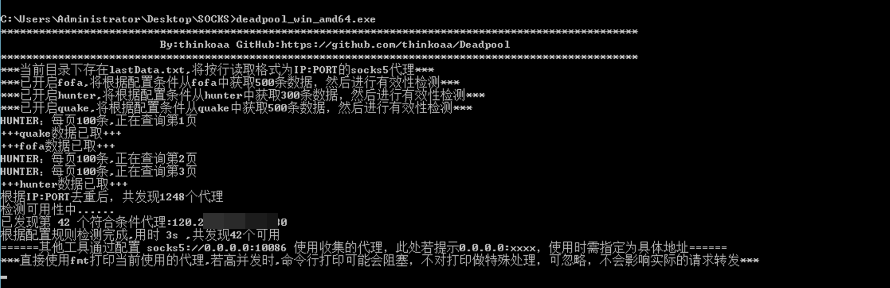

监听到请求后，会轮询收集的代理来转发

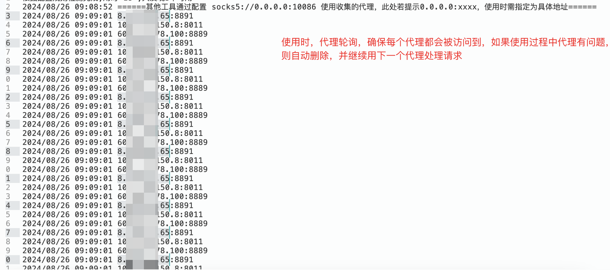

验证走socks5代理时的出口IP

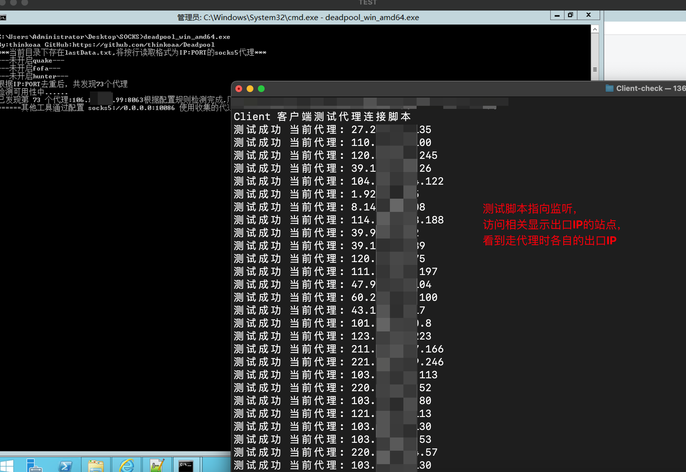

目录爆破场景

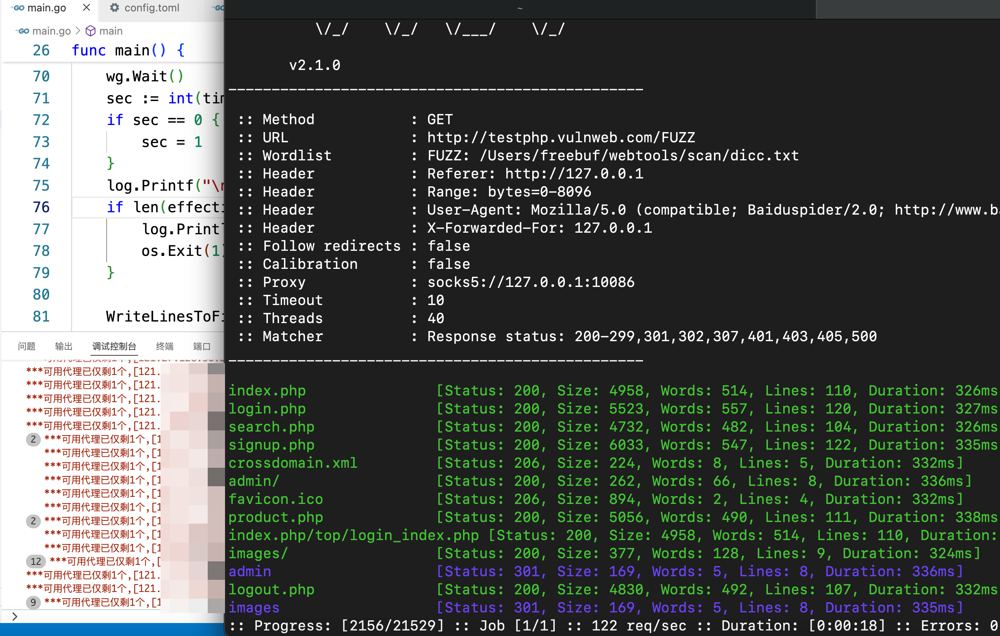

### 0x03 配置使用

**burp中配置**

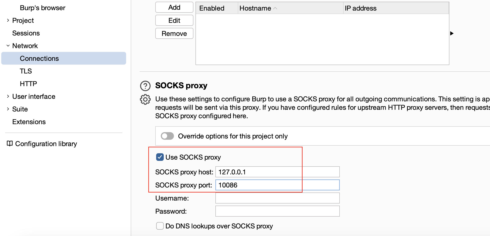

**Proxifier配置**

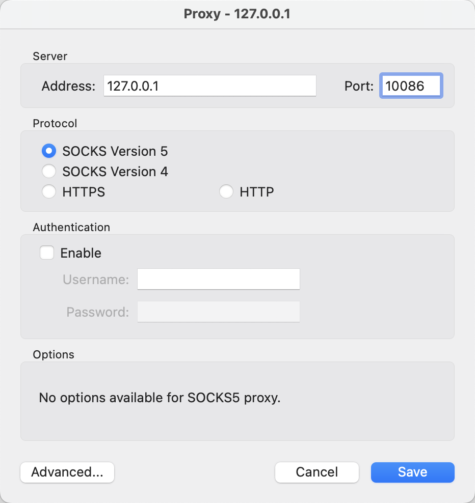

**SwitchyOmega配置**

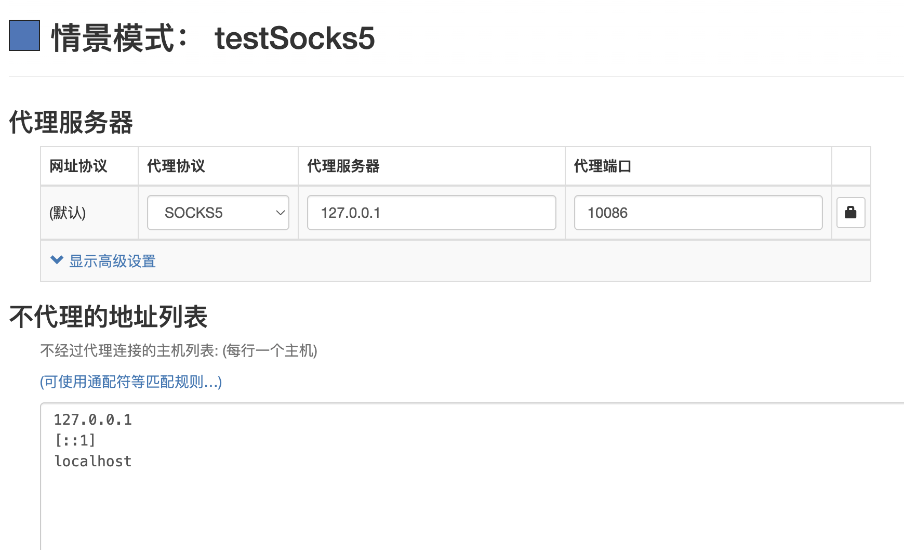

其他工具使用时同理，指定socks5协议，IP、端口即可

### 0x04 配置文件说明

简单使用的话，只需要修改对应的网络空间测绘平台的key信息即可。

**但需注意（没特殊需求可以忽略这里）：**

1、若可能会发送恶意的payload，某些代理可能会阻断这类请求出站，需先关闭[checkSocks.checkGeolocate]中的switch（默认关闭），然后修改[checkSocks]中的checkURL为没有waf防护的任意公网地址，使用如/webshell.aspx?f=../../../../../../etc/passwd&q=1' or union select 1,2,3,4这类的测试语句，修改checkRspKeywords的值为目标正常返回内容中的字符片段，如此，可以获得不拦截恶意payload出站的代理。

2、若针对性访问某地址，需要先关闭[checkSocks.checkGeolocate]中的switch（默认关闭），然后修改[checkSocks]中的checkURL为该地址，修改checkRspKeywords的值，确保只保留可以访问目标地址的代理。

**1和2结合，就能不断收集、使用针对高可用代理。**

config.toml详细说明如下：

```toml
[listener]
#******非特殊情况，默认即可******本地监听端口，其他工具中的SOCKS5代理指定为该IP:PORT，即可轮询使用收集的代理
IP='127.0.0.1'
PORT='10086'
userName=''#用户名和密码都不为空时，会进行认证，防止部署到vps上时，被其他人使用
password='' 

[task]#周期性任务,若不为空，则会执行（请注意格式）
periodicChecking=''#如0 */5 * * *为每5小时按照[checkSocks]中的配置检查一次内存中已有代理的存活性，如果为空，不单独周期性检查
periodicGetSocks=''#如0 6 * * 6为每周六早上6点去通过fofa、hunter、quake的配置去取数据，顺便一起把本地历史存的也校验一下

[checkSocks]#******非特殊情况，默认即可******
#通过访问实际url来验证代理的可用性
checkURL='https://www.baidu.com'#可以配置为要访问的目标地址，确保所有代理都能访问到目标地址
checkRspKeywords='百度一下'#上面地址原始响应中的某个字符串，用来验证通过代理访问目标时有无因某种原因被ban掉。
maxConcurrentReq='30'#同时最多N个并发通过代理访问上面的地址，检测socks5代理是否可用，可根据网络环境调整。云主机的话开500、1000都可以，本机的话，开三五十差不多。
timeout='6'#单位秒，验证socks5代理的超时时间,建议保持在5或6，检查及使用代理访问上面的地址时，超过这个时间，判定无效

[checkSocks.checkGeolocate]
##******非特殊情况，默认即可******通过访问返回IP归属地信息的URL和关键字判断，来排除某些代理，如：某些情况下，真正要访问的系统限制只有大陆地区IP可以访问
switch='close' #open:启用，非open:禁用
checkURL='https://qifu-api.baidubce.com/ip/local/geo/v1/district'#访问此url获取IP归属地信息，出于某些原因，建议用国内的公司的相关接口。
#下面的两个的值，需要根据上面url的返回内容填写
excludeKeywords=['澳门','香港','台湾']#格式如：['澳门','香港']优先级最高，返回的body内容中，存在任一关键字，则跳过
includeKeywords=['中国']#格式如：['中国','北京']则只获取出口IP为中国北京的代理，如果是['中国'],排除上述关键字的前提下则获取出口IP为中国所有其他地区代理

[FOFA] 
switch = 'close' #open:启用，非open:禁用
apiUrl='https://fofa.info/api/v1/search/all'
email = 'xxxxx@xxx.com'
key = '54eddce1xxxxxxxxxxxxxxxx49836612'
queryString = 'protocol=="socks5" && country="CN" && banner="Method:No Authentication"'#官方语法
resultSize='500' #此处最大为10000,需小于等于从官网web界面看到的结果数量

[QUAKE] 
switch = 'close' 
apiUrl='https://quake.360.net/api/v3/search/quake_service'
key = '962xxx36-xxxxxxxxxxxxxxxx-5efxxxxfc90b0a'
queryString = 'service:socks5  AND country: "CN" AND response:"No authentication"'#官方语法
resultSize='500' #此处最大为10000,需小于等于从官网web界面看到的结果数量

[HUNTER]
switch = 'close'
apiUrl='https://hunter.qianxin.com/openApi/search'
key = '9c1698e0xxxxxxxxxxxxxxxxa6e90758edcxxxx23533f9xxxxxxxxxxxxxxxx9ce18'
queryString = 'protocol=="socks5"&&protocol.banner="No authentication"&&ip.country="CN"'#官方语法
resultSize='300' #最小为100,按100条/每页翻页，最大值需小于从官网web界面看到的结果数量，值需为100的整倍数，如200、300、1000、2000等
```

### 0x05 GitHub Action 自动化搜集代理工具

针对于个人使用场景，如果需要该脚本在GitHub自动获取并更新 lastData.txt, 可以按照以下流程进行设置：

1. import repository

由于 fork 仓库无法无法修改仓库的可见性，也就是无法将仓库设置成私有形式。所以需要进行import.

> **开发不易,如果觉得该项目对您有帮助, 麻烦点个Star吧**

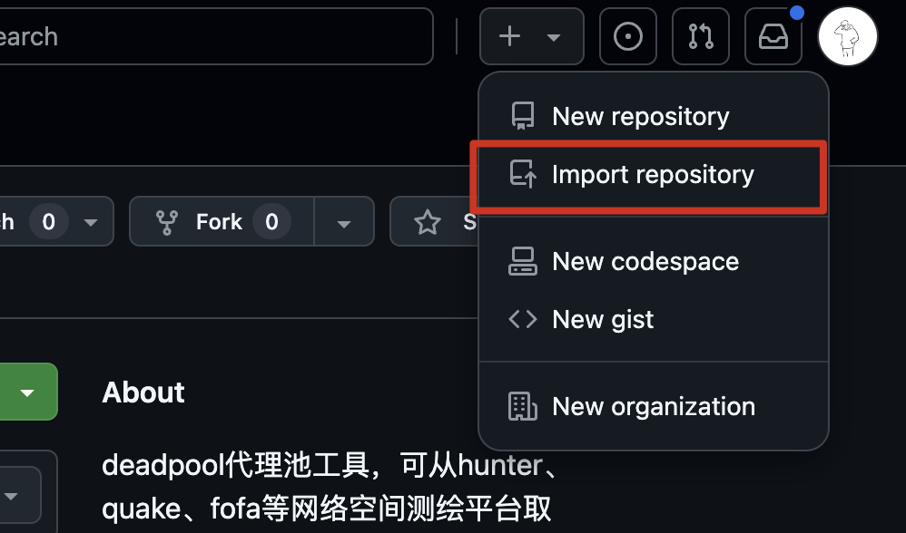


**记得勾选 Private!!!**

2. 设置 workflows 脚本

将 import 的仓库clone到本地, 配置 action workflows 脚本到 `.github/workflows/schedule.yml`目录：

```yaml
name: schedule

on:
  workflow_dispatch:
  schedule:
    - cron: "0 0 */5 * *"

jobs:
  build:
    runs-on: ubuntu-latest

    steps:
      - name: Check out code into the Go module directory
        uses: actions/checkout@v3
        with:
          fetch-depth: 0

      - name: "Set up Go"
        uses: actions/setup-go@v4
        with:
          go-version: 1.23.x
          check-latest: true
          cache: true
      
      - name: Run search
        run: |
          bash entrypoint.sh

        
      - name: Commit and push if it changed
        run: |
          git config --global user.name 'xxx'
          git config --global user.email 'xxxx'
          if git diff --quiet -- lastData.txt; then
           echo "lastData.txt has not been modified."
          else
           git add lastData.txt
           git commit -m "update lastData.txt"
           git push
          fi
```

-  示例脚本的运行频率为 `每五天运行一次`, 可以根据需要，自行调整 `cron: "0 0 */5 * *"`

- 根据自己情况替换 `user.name 'xxx'` 和 `user.email 'xxxx'` 的 `xxx`


3. 设置启动脚本 `entrypoint.sh`

```sh
#!/bin/bash
go build -o deadpool main.go
timeout --preserve-status 150 ./deadpool
status=$?
if [ $status -eq 124 ]; then
    echo "The command timed out."
else
    echo "The command finished successfully."
fi
exit 0
```

- 其中需要注意：由于项目是以阻塞形式的, 所以这里使用了 `timeout` 进行超时退出. 你可以根据跑的数据量设置 `entrypoint.sh` 脚本中的 `150` 为需要的值, 当然越大越好，否则如果地址还未验证完，程序退出的话做不会进行 `lastData.txt` 的写入操作.

4. 配置 Action 的写入权限.

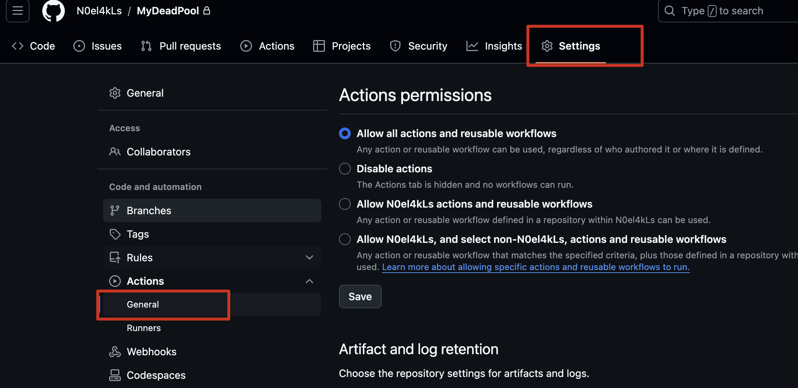

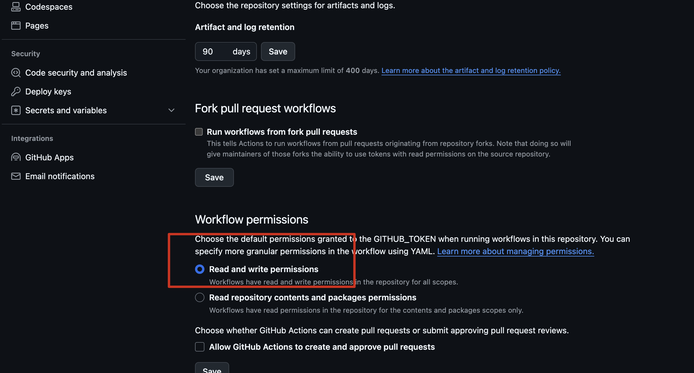

5. 修改 `config.toml` 配置文件

根据自己情况替换各种 key 就行了. 

**注意：一定记得讲仓库设置为私有, 否则 key 会泄漏！！！**

完整目录结构：

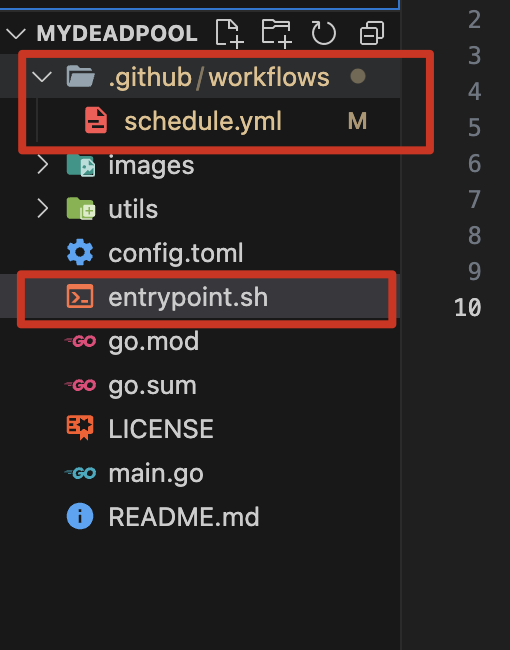
